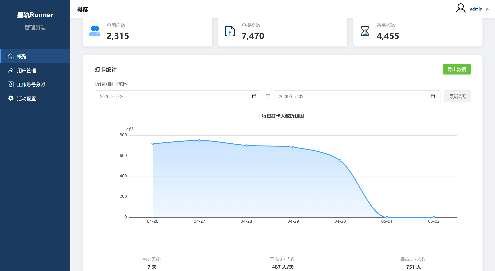
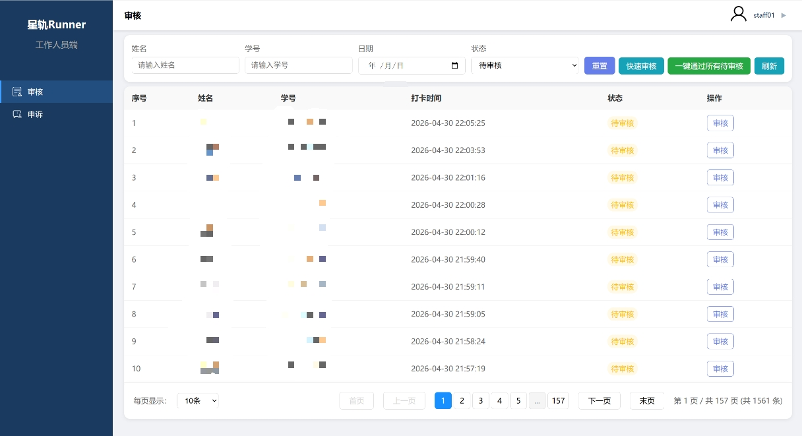

# 星轨Runner - 校园夜跑管理系统（Web管理端）

## 项目概述

星轨Runner Web管理端是基于Vue 3开发的校园夜跑管理平台，为管理员和工作人员提供数据统计、用户管理、审核处理等后台管理功能。系统采用角色权限控制，支持管理员和工作人员两种不同权限的用户登录。

## 技术架构

### 前端技术栈
- **框架**: Vue 3 + Composition API
- **路由**: Vue Router 4
- **状态管理**: Vuex 4
- **构建工具**: Vite 7.2.4
- **UI组件**: 原生CSS + 自定义组件
- **图表库**: ECharts 6.0.0

### 后端技术栈
- **云开发平台**: 腾讯云云开发 (CloudBase)
- **云函数**: Node.js 运行环境
- **数据库**: 云开发数据库 (NoSQL)
- **认证**: JWT Token + 本地存储

### 开发工具
- **开发环境**: Vite Dev Server
- **代码编辑器**: VS Code
- **版本控制**: Git
- **包管理**: npm

## 功能简介

登录认证：支持管理员和工作人员双角色登录，包含角色选择、账号验证和权限控制

系统概览：提供数据统计仪表盘，包含用户总数、提交总数、待审核数等关键指标，支持ECharts图表展示

用户管理：支持用户信息查看、状态管理、筛选搜索和批量操作，包含校区、书院、状态等多维度筛选

工作人员管理：工作人员账号管理，支持账号创建、权限分配、状态控制和信息维护

活动配置：夜跑活动参数配置，包含学期设置、时间范围、打卡规则等系统参数管理

审核管理：工作人员审核跑步记录，支持批量审核、筛选搜索和详细记录查看

申诉处理：处理用户申诉请求，包含申诉列表、详情查看、审核处理和结果反馈

数据导出：根据日期范围，可导出单日打卡用户表、累积打卡统计和获奖名单

## 项目结构

```
web_end/
├── public/                 # 静态资源
│   └── vite.svg
├── src/                    # 源码目录
│   ├── api/               # API接口
│   │   ├── admin.js       # 管理员API
│   │   ├── login.js       # 登录API
│   │   └── staff.js       # 工作人员API
│   ├── assets/            # 资源文件
│   │   └── *.svg          # SVG图标
│   ├── cloud/             # 云开发配置
│   │   └── index.js       # 云函数调用封装
│   ├── components/        # 公共组件
│   │   └── Layout/        # 布局组件
│   │       ├── Header.vue # 顶部导航
│   │       ├── Layout.vue # 主布局
│   │       └── Sidebar.vue # 侧边栏
│   ├── router/            # 路由配置
│   │   └── index.js       # 路由定义
│   ├── store/             # 状态管理
│   │   └── store.js       # Vuex Store
│   ├── utils/             # 工具函数
│   │   ├── auth.js        # 认证工具
│   │   └── toast.js       # 消息提示
│   ├── views/             # 页面组件
│   │   ├── admin/         # 管理员页面
│   │   │   ├── AdminLayout.vue     # 管理员布局
│   │   │   ├── Overview.vue        # 系统概览
│   │   │   ├── UserManagement.vue  # 用户管理
│   │   │   ├── StaffAccount.vue    # 工作人员管理
│   │   │   └── ActivityConfig.vue  # 活动配置
│   │   ├── staff/         # 工作人员页面
│   │   │   ├── StaffLayout.vue     # 工作人员布局
│   │   │   ├── Audit.vue           # 审核管理
│   │   │   ├── AuditDetail.vue     # 审核详情
│   │   │   ├── Appeal.vue          # 申诉管理
│   │   │   └── AppealDetail.vue    # 申诉详情
│   │   ├── Login.vue      # 登录页面
│   │   └── NotFound.vue   # 404页面
│   ├── App.vue            # 根组件
│   ├── main.js            # 入口文件
│   └── style.css          # 全局样式
├── .env                   # 环境变量
├── index.html             # HTML模板
├── vite.config.js         # Vite配置
└── package.json           # 依赖管理
```

## 界面展示



